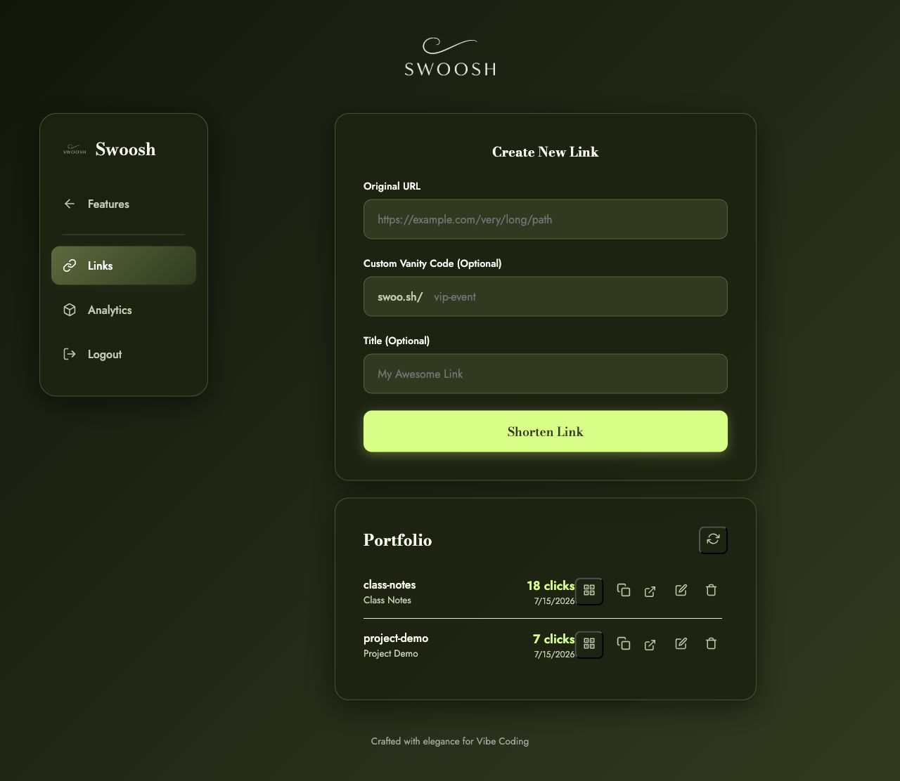

# Swoosh - URL Shortener and Link-in-Bio Builder


**Swoosh turns long URLs into short, trackable links and lets each account build up to five public link-in-bio pages.** It is useful for students, creators, clubs, small teams, and anyone who wants to own their links instead of depending entirely on a hosted shortening or profile service.

[Live demo](https://swoo-sh.onrender.com) | [API docs](https://swoo-sh.onrender.com/docs) | [Report an issue](https://github.com/ahk1542001-wq/url-shortener-api/issues)

> Accounts are created by an administrator. Public self-registration is intentionally disabled.

## What Can I Do With It?

You do not need to be a developer to use a deployed Swoosh instance.

1. Sign in with an account supplied by the administrator.
2. Choose **Shortener** to create a short URL with an optional custom code.
3. Choose **Link Tree** to create and manage public profile pages.
4. Add a bio, avatar, and social or website links to each profile.
5. Share the short URL, public profile URL, or locally generated QR code.
6. Review link clicks and Link Tree visits from separate analytics views.

Each login account can create **up to five Link Tree profiles**. Standalone short links remain separate from profile-specific links, so a private link collection does not automatically appear on a public page.

## Product Tour

| Landing and feature selection | Link management |
|---|---|
|  |  |

| Link Tree workspace | Public Link Tree |
|---|---|
|  |  |

Mobile screenshots are available in [`screenshots/`](screenshots/).

## Features

| Area | Included |
|---|---|
| Short links | Generated codes, custom vanity codes, copy, edit, delete, and QR display |
| Analytics | Redirect click totals, daily statistics, and Link Tree visit counts |
| Link Trees | Up to five profiles per account, profile switching, bio, avatar, and social links |
| Accounts | JWT login, bcrypt password hashes, and admin-created users |
| Storage | SQLite for local development and Neon PostgreSQL for production |
| Avatar media | Validated image uploads stored in Cloudinary |
| Security | Input validation, rate limiting, security headers, reserved routes, and structured errors |
| Interface | Responsive Olive Ink and Warm Lime UI with desktop and mobile top navigation |
| QR codes | Generated locally in the browser; no external QR request is required |

## For Developers

### Architecture

Swoosh is a small monolithic web application:

```text
Browser (HTML/CSS/JS)
        |
        v
FastAPI on Render -----> Cloudinary (avatars)
        |
        +-------------> Neon PostgreSQL (production)
        |
        +-------------> SQLite (local development)
```

The frontend is served directly by FastAPI. Authenticated API requests use a bearer JWT. The `X-Active-Profile` header selects a Link Tree profile; omitting it selects the standalone shortener workspace.

More detail is available in [`wiki/architecture.md`](wiki/architecture.md), [`docs/SPEC.md`](docs/SPEC.md), and [`docs/PLAN.md`](docs/PLAN.md).

### Requirements

- Python 3.11
- Git
- A modern browser
- Optional: Neon PostgreSQL for production-compatible database testing
- Optional: Cloudinary for avatar uploads

### Local Setup

```bash
git clone https://github.com/ahk1542001-wq/url-shortener-api.git
cd url-shortener-api

python3.11 -m venv .venv
source .venv/bin/activate
pip install -r requirements.txt

cp .env.example .env
openssl rand -hex 32
python -c "from passlib.hash import bcrypt; print(bcrypt.hash('CHANGE_THIS_ADMIN_PASSWORD'))"
```

Put the generated secret and bcrypt hash in `.env`:

```dotenv
DATABASE_URL=
DB_NAME=shortener.db
JWT_SECRET=PASTE_THE_64_CHARACTER_OPENSSL_OUTPUT
ADMIN_PASSWORD_HASH=PASTE_THE_BCRYPT_HASH
RATE_LIMIT=30/minute
```

Leave `DATABASE_URL` empty to use SQLite. Then start the application:

```bash
uvicorn src.main:app --reload --port 8000
```

Open:

- Application: `http://127.0.0.1:8000`
- Interactive API documentation: `http://127.0.0.1:8000/docs`
- Health check: `http://127.0.0.1:8000/api/health`

The configured `admin` account is created or updated during database initialization. Use the admin dashboard to create normal user accounts.

### Enable Avatar Uploads

Create a Cloudinary account and set all three variables together:

```dotenv
CLOUDINARY_CLOUD_NAME=your_cloud_name
CLOUDINARY_API_KEY=your_api_key
CLOUDINARY_API_SECRET=your_api_secret
```

If none are set, the rest of Swoosh still works and avatar upload returns a clear `503` configuration error. Partial Cloudinary configuration is rejected at startup.

### Environment Variables

| Variable | Required | Purpose |
|---|---:|---|
| `JWT_SECRET` | Yes | Signs JWTs; must be at least 32 characters and not a placeholder |
| `ADMIN_PASSWORD_HASH` | Yes | Valid bcrypt hash for the deterministic admin account |
| `DATABASE_URL` | Production | Neon/PostgreSQL connection string; empty uses SQLite |
| `DB_NAME` | SQLite only | SQLite file path; defaults to `shortener.db` |
| `RATE_LIMIT` | No | Shorten endpoint limit; defaults to `30/minute` |
| `HOST` | No | Bind host; defaults to `0.0.0.0` |
| `PORT` | No | Bind port; defaults to `5000` |
| `CLOUDINARY_CLOUD_NAME` | Avatar uploads | Cloudinary cloud name |
| `CLOUDINARY_API_KEY` | Avatar uploads | Cloudinary API key |
| `CLOUDINARY_API_SECRET` | Avatar uploads | Cloudinary API secret |

Never commit `.env`, database credentials, API secrets, or production database URLs.

## API Overview

All private endpoints require `Authorization: Bearer <token>`. Profile-specific requests also send `X-Active-Profile: <profile-username>`.

| Method | Path | Purpose |
|---|---|---|
| `POST` | `/api/login` | Authenticate and receive a JWT |
| `GET` | `/api/profiles` | List the account's profiles and profile limit |
| `POST` | `/api/profiles` | Create a Link Tree profile |
| `GET` / `PUT` | `/api/me` | Read or update the active profile |
| `POST` | `/api/profiles/avatar` | Validate and upload an avatar |
| `POST` | `/api/shorten` | Create a standalone or profile-scoped short link |
| `GET` | `/api/links` | List links in the current workspace |
| `PUT` / `DELETE` | `/api/links/{code}` | Update or delete a link |
| `GET` | `/api/analytics` | Return analytics for the current workspace |
| `GET` | `/api/users/{username}/tree` | Public Link Tree JSON |
| `GET` | `/u/{username}` | Public Link Tree page |
| `GET` | `/{code}` | Redirect a short code and record a click |
| `GET` | `/api/health` | Service health check |

### Example: Log In and Create a Standalone Link

```bash
TOKEN=$(curl -sS -X POST http://127.0.0.1:8000/api/login \
  -H 'Content-Type: application/json' \
  -d '{"username":"admin","password":"YOUR_ADMIN_PASSWORD"}' \
  | python -c 'import json,sys; print(json.load(sys.stdin)["token"])')

curl -X POST http://127.0.0.1:8000/api/shorten \
  -H "Authorization: Bearer $TOKEN" \
  -H 'Content-Type: application/json' \
  -d '{"url":"https://example.com/long/path","custom_code":"example-link","title":"Example"}'
```

### Validation Rules

- URLs must begin with `http://` or `https://` and be at most 2048 characters.
- Custom codes must be 3-20 characters containing letters, numbers, or hyphens.
- Profile usernames must be 3-30 characters containing letters, numbers, or hyphens.
- Reserved names include `api`, `admin`, `static`, `health`, `docs`, `openapi`, `tree`, and `u`.
- Profile bios reject HTML and are limited to 500 characters.

Errors use a consistent structure:

```json
{"error":{"code":422,"message":"URL must start with http:// or https://"}}
```

## Testing and Quality Checks

```bash
./.venv/bin/python -m pytest -v
./.venv/bin/ruff check .
./.venv/bin/ruff format --check .
node --check static/script.js
git diff --check
```

The PostgreSQL migration integration test is skipped unless a disposable `POSTGRES_TEST_URL` is provided. It also requires `ALLOW_DESTRUCTIVE_POSTGRES_TESTS=yes` and rejects database names that do not contain `test`.

## Deployment

The reference deployment uses Render, Neon PostgreSQL, and Cloudinary.

1. Create a Neon project and copy its pooled PostgreSQL connection string.
2. Create a Cloudinary account if avatar upload is required.
3. Create a Render web service from this repository using the included Dockerfile or `render.yaml`.
4. Set `DATABASE_URL`, `JWT_SECRET`, `ADMIN_PASSWORD_HASH`, and the optional Cloudinary variables.
5. Before a migration, create a Neon branch or snapshot and rehearse against a disposable test branch.
6. Deploy and verify `/api/health`, login, shortening, redirect, profile switching, public Link Tree, analytics, and avatar upload.

See [`docs/SHIP.md`](docs/SHIP.md) for the complete deployment and rollback checklist.

## Project Layout

```text
src/          FastAPI application, routers, database, auth, and analytics
static/       Responsive frontend, public Link Tree, logo, and local QR library
tests/        API, migration, security, UI contract, and lifecycle tests
docs/         Specification, plan, ship checklist, and project report
wiki/         Architecture, decisions, and implementation patterns
screenshots/  Desktop and mobile product screenshots
slides/       Marp presentation source and exported PDF
```

## Contributing

Issues and pull requests are welcome. Read [`CONTRIBUTING.md`](CONTRIBUTING.md) before submitting a change. Please keep changes scoped, include tests for behavior changes, update relevant docs and screenshots, and run the full verification suite.

For security problems, follow [`SECURITY.md`](SECURITY.md) instead of opening a public issue.

## License

Swoosh is available under the [MIT License](LICENSE).
