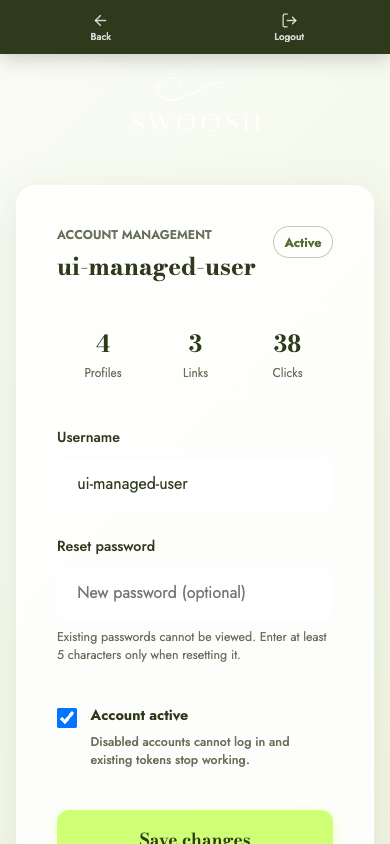
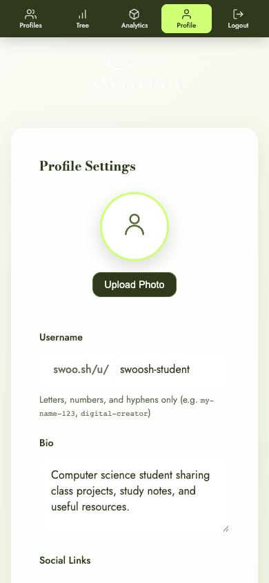

# Product Screenshot Guide

The `screenshots/` directory documents the complete user-facing Swoosh workflow.
Every major state is captured at a fixed desktop viewport (`1440x900`) and mobile
viewport (`390x844`) where that state is relevant. The images contain clean demo
content only; they do not contain production secrets, database URLs, passwords,
or private account information.

## Screenshot Index

| # | State | Desktop | Mobile | What It Demonstrates |
|---:|---|:---:|:---:|---|
| 01 | Landing | Yes | Yes | Product identity, value proposition, and main entry point |
| 02 | Login | Yes | Yes | Administrator-created account authentication |
| 03 | Admin users | Yes | Yes | Account status, profile, link, and click totals |
| 04a | Admin user management | Yes | Yes | Owned-data summary, password reset, status, edit, and delete controls |
| 04b | Create user | Yes | Yes | Administrator-only account creation form |
| 05 | Feature selection | Yes | Yes | Separate Shortener and Link Tree workspaces |
| 06 | Profile selection | Yes | Yes | Multiple Link Tree profiles and the five-profile limit |
| 07 | Create profile | Yes | No | New public profile form before the fifth profile is created |
| 08 | Shortener | Yes | Yes | URL, vanity code, title, and create action |
| 09 | Portfolio | Yes | Yes | Link totals and QR/copy/open/edit/delete actions |
| 10 | QR modal | Yes | Yes | Locally generated QR code with download action |
| 11 | Edit link | Yes | Yes | Destination and title editing |
| 12 | Shortener analytics | Yes | Yes | Per-link click totals isolated from Link Tree visits |
| 13 | Link Tree sharing | Yes | Yes | Public URL, QR code, views, and live-page action |
| 14 | Profile settings | Yes | Yes | Avatar, bio, social links, and profile details |
| 15 | Link Tree analytics | Yes | Yes | Public URL, tree views, and published-link count |
| 16 | Public Link Tree | Yes | Yes | Final visitor-facing profile and responsive link cards |

Files use the pattern `<number>_<state>_<viewport>.png`, for example:

```text
screenshots/09_portfolio_desktop.png
screenshots/09_portfolio_mobile.png
```

## Representative Views

| Desktop admin management | Mobile admin management |
|---|---|
|  |  |

| Desktop profile settings | Mobile profile settings |
|---|---|
|  |  |

| Desktop public Link Tree | Mobile public Link Tree |
|---|---|
|  |  |

## Regenerating the Set

[`scripts/capture_docs_screenshots.py`](../scripts/capture_docs_screenshots.py)
uses Playwright with the installed Chrome channel. It expects a clean, seeded
demo instance with an administrator account, a normal user, four Link Tree
profiles, standalone links, and one populated profile named `swoosh-student`.
Credentials are supplied through environment variables and are never stored in
the script or committed to the repository.

```bash
export SWOOSH_SCREENSHOT_URL="http://127.0.0.1:8002"
export SWOOSH_DOCS_ADMIN_PASSWORD="your-local-admin-password"
export SWOOSH_DOCS_DEMO_USERNAME="swoosh-demo"
export SWOOSH_DOCS_DEMO_PASSWORD="your-local-demo-password"

python3.11 scripts/capture_docs_screenshots.py
```

The script clears only existing PNG files inside the selected screenshot output
directory, logs in through the real UI, visits each state, disables animation,
and writes true PNG files at stable viewport sizes. Use a disposable local
database for regeneration. Do not point the script at production unless the
account and data were created specifically for documentation.

## Visual QA Checklist

- No password, token, API key, database URL, or personal information is visible.
- Text is legible and does not overlap controls.
- Desktop navigation uses the sidebar and mobile navigation uses the sticky top bar.
- Cards and dialogs are centered within the viewport.
- Portfolio actions do not compress titles or click counts.
- QR codes are fully visible and scannable.
- Public Link Tree cards align consistently at both viewports.
- Images are real PNG files at the documented dimensions.
