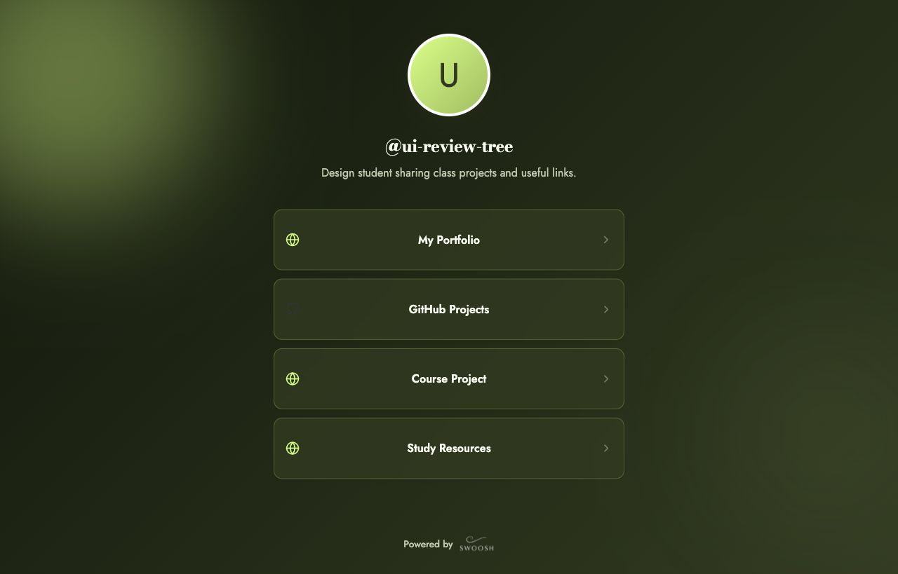
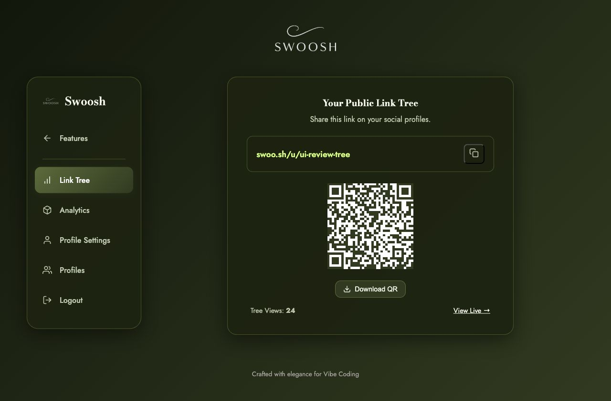

# Swoosh
## Short links and link-in-bio pages that you own

**Live:** [swoo-sh.onrender.com](https://swoo-sh.onrender.com)

FastAPI + Neon PostgreSQL + Cloudinary

Open source under the MIT License

---


# One account, two workspaces

**Shortener**
- Create generated or custom short URLs.
- Manage links, QR codes, and click analytics.

**Link Tree**
- Create up to five public profiles.
- Share a bio, avatar, social links, and visit count.

---



# Designed for real sharing

- Public pages at `/u/{username}`
- Responsive desktop and mobile layouts
- Olive Ink and Warm Lime visual identity
- Platform icons and QR codes generated locally
- Administrator-created accounts

---

# Architecture

```text
Browser (Vanilla HTML, CSS, JavaScript)
                    |
                    v
             FastAPI on Render
              /             \
             v               v
 Neon PostgreSQL         Cloudinary
 links, users, stats     validated avatars
```

- SQLite provides a simple local development path.
- JWT protects private operations.
- `X-Active-Profile` selects one of five Link Tree profiles.
- Parameterized SQL supports SQLite and PostgreSQL.

---



# Production hardening

- Validation, rate limits, headers, and secure startup
- Atomic SQLite/PostgreSQL migrations
- Neon backup and migration rehearsal
- **73 local tests passing**
- Ruff, JavaScript, and whitespace checks

---

# Open source and ready to learn from

The repository includes:

- Beginner-friendly and developer setup instructions
- Architecture, decisions, and implementation patterns
- API examples and deployment checklist
- Desktop and mobile product screenshots
- Contribution and security-reporting guides
- A guarded PostgreSQL migration integration test

**GitHub:** [github.com/ahk1542001-wq/url-shortener-api](https://github.com/ahk1542001-wq/url-shortener-api)

---

# Next steps

1. Add a project-owned custom domain.
2. Expand privacy-conscious analytics.
3. Complete an accessibility audit.
4. Add automated browser regression screenshots.

**Thank you.**
