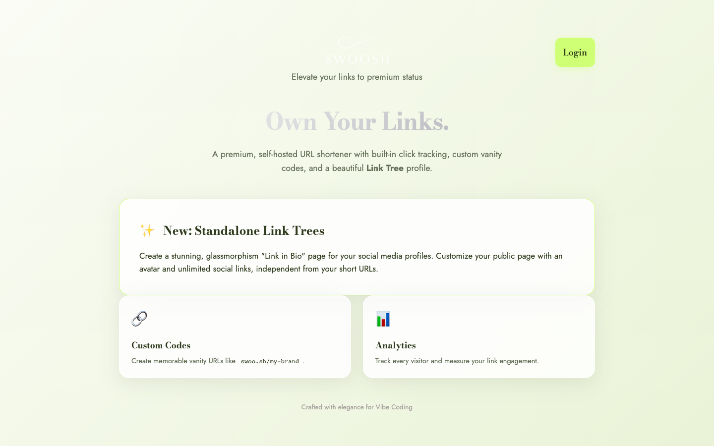
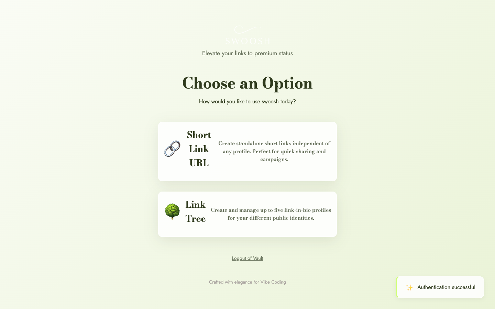
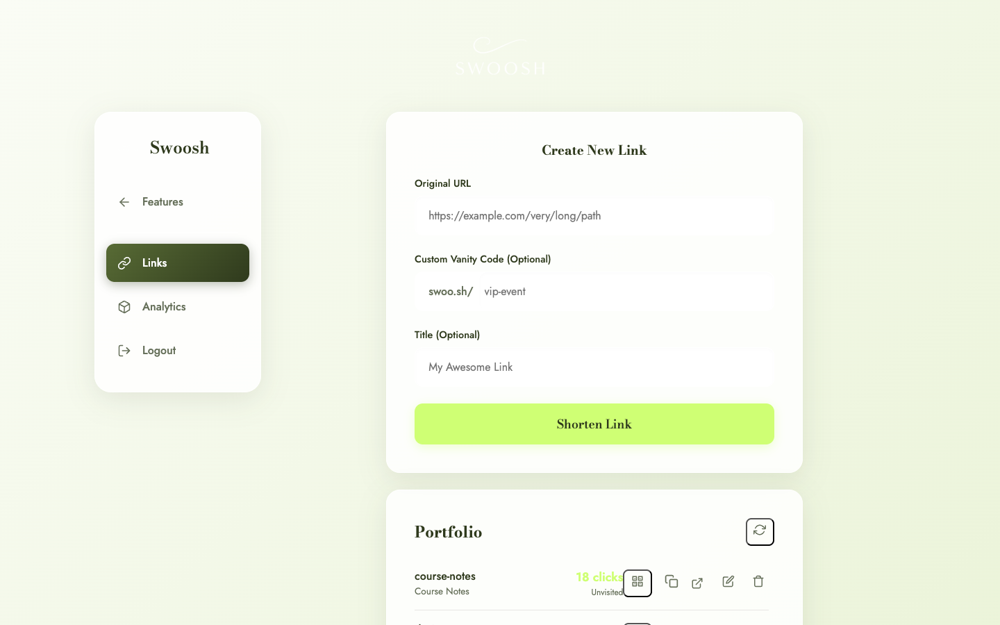
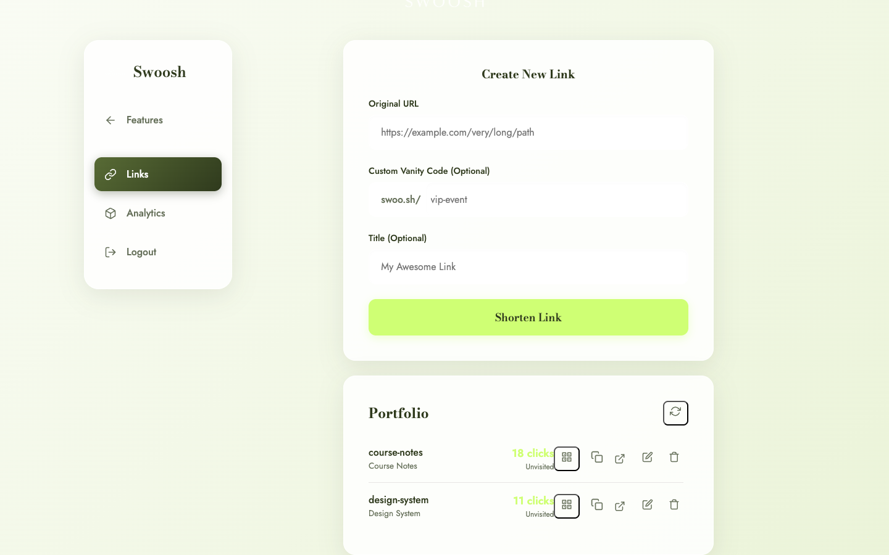
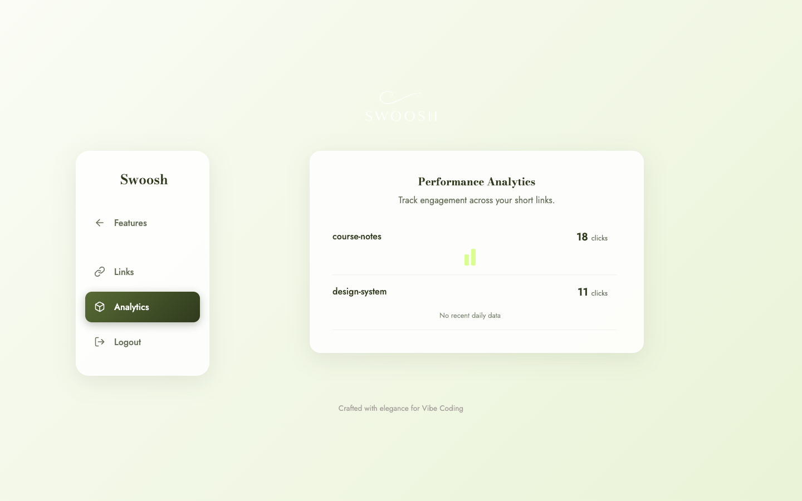
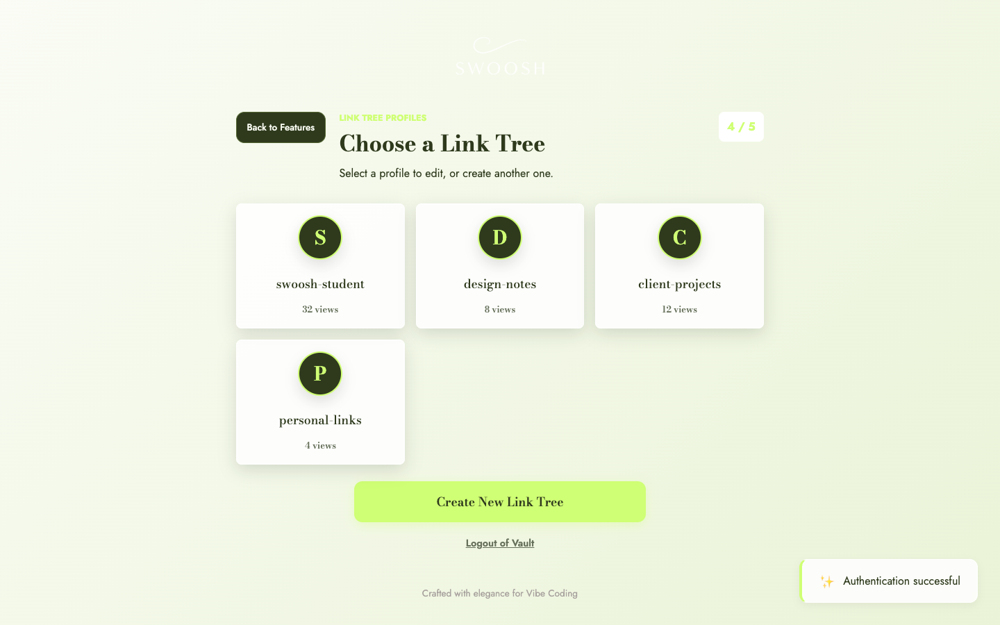
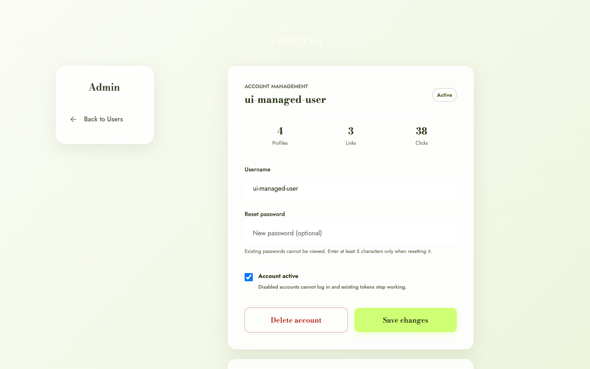
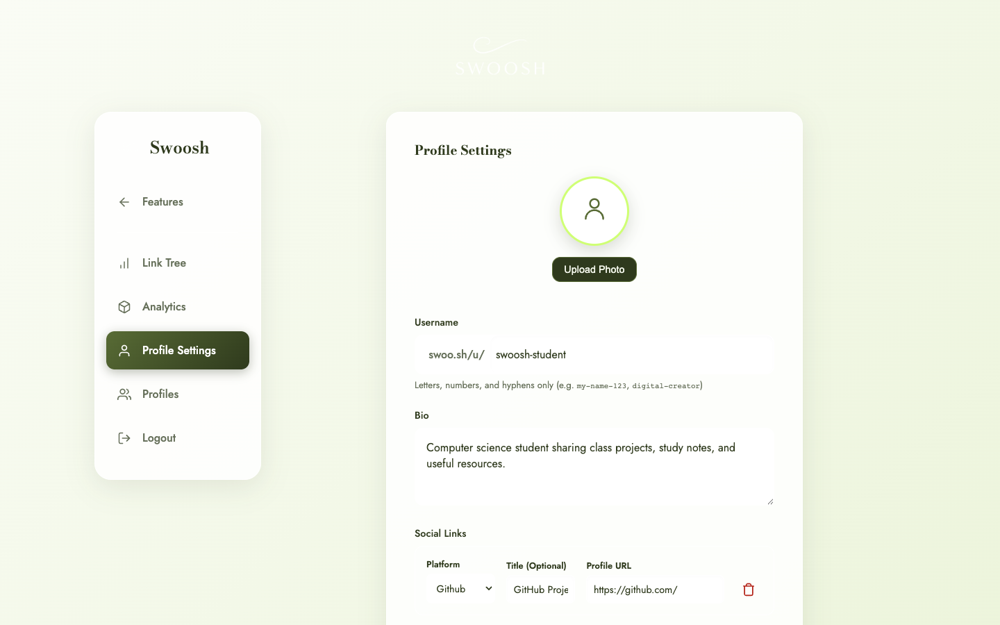
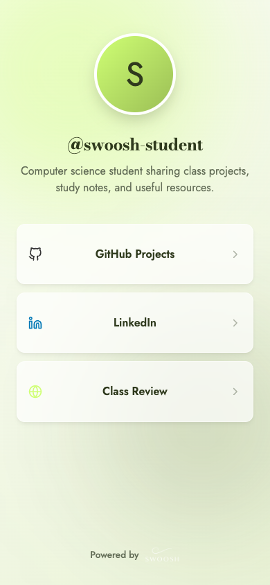

# Swoosh
## URL shortener and link-in-bio builder

**Live:** [swoo-sh.onrender.com](https://swoo-sh.onrender.com)

FastAPI + Neon PostgreSQL + Cloudinary

Open source under the MIT License

---



# The problem

Long URLs are difficult to remember and awkward to share.

Creators and students also need one public page that groups their important links without giving up control of their data or branding.

**Swoosh combines both needs in one self-hosted application.**

---



# One account, two workspaces

**Shortener**
- Create generated or custom short URLs.
- Manage QR codes, destinations, and click analytics.
- Keep standalone links private from public profiles.

**Link Tree**
- Build public link-in-bio pages.
- Manage profiles, social links, and visit analytics.

---



# Shorten and organize

1. Enter an `http://` or `https://` destination.
2. Optionally choose a memorable vanity code.
3. Add a readable title.
4. Create, copy, open, edit, or delete the result.

Reserved routes and invalid destinations are rejected before storage.

---



# Portfolio and QR sharing

- Click totals remain visible beside every link.
- Action buttons use consistent QR, copy, open, edit, and delete icons.
- QR codes are generated locally from a vendored browser library.
- No URL is sent to a third-party QR service.

---



# Analytics stay understandable

**Shortener analytics** show per-link redirect clicks.

**Link Tree analytics** show public profile visits and published-link totals.

The two workspaces are deliberately isolated so users know what each number means.

---



# Multiple public identities

Each login account can create and switch among **up to five Link Tree profiles**.

This supports separate pages for:

- a personal portfolio
- class projects
- study resources
- clubs or campaigns
- professional links

---



# Recoverable account management

- Review profile, link, click, and visit totals.
- Rename normal accounts.
- Reset a password without exposing the existing bcrypt hash.
- Disable access immediately, including existing JWTs.
- Delete user-owned application data transactionally.

The environment-managed `admin` identity remains protected.

---



# Profile customization

- Unique public username
- Bio with HTML blocked
- Validated avatar upload to Cloudinary
- Social platform, custom title, and profile URL
- Clear warning before changing a public username

Profile-specific API calls use the `X-Active-Profile` header.

---



# Visitor-facing Link Tree

- Public route: `/u/{username}`
- Responsive link cards and platform icons
- Olive Ink and Warm Lime identity
- Visible Swoosh attribution
- Desktop and mobile layouts tested independently

Public pages require no login.

---

# Architecture

```text
Browser (Vanilla HTML, CSS, JavaScript)
                    |
                    v
             FastAPI on Render
              /             \
             v               v
 Neon PostgreSQL         Cloudinary
 users, links, stats     validated avatars
```

- SQLite provides a zero-service local development path.
- JWT protects private operations; bcrypt protects passwords.
- Parameterized SQL supports SQLite and PostgreSQL.

---

# How it was built

1. **Spec** - define behavior, validation, and boundaries.
2. **Plan** - split delivery into testable stages.
3. **Build** - routers, migrations, UI workspaces, QR, and media.
4. **Review** - audit correctness, security, accessibility, and responsive UI.
5. **Ship** - verify, document, deploy, and rehearse rollback.

AI coding agents helped implement and audit changes. Product decisions and every final workflow were manually reviewed.

---

# Production hardening

| Area | Protection |
|---|---|
| Authentication | Expiring JWTs and bcrypt password hashes |
| Account control | Immediate disablement and protected admin identity |
| Abuse | `30/minute` shortening rate limit |
| Input | Pydantic validation and reserved-name checks |
| Frontend | Escaped user content and security headers |
| Database | Atomic migrations, FK checks, sequence resets |
| Media | Size, dimension, decode, and re-encode checks |
| Recovery | Neon backup branch and Render rollback |

---

# Verification evidence

- **80** local tests passing
- One destructive PostgreSQL integration test guarded and optional
- Ruff lint and format checks
- JavaScript syntax and whitespace checks
- **33** true PNG UI captures
- Desktop `1440x900` and mobile `390x844`
- Render health check returns HTTP `200` with `{"status":"ok"}`

---

# Deployment

1. GitHub `main` triggers Render Auto-Deploy.
2. Render builds the repository Dockerfile.
3. Secrets are injected through Render environment variables.
4. FastAPI connects to Neon and Cloudinary.
5. Render checks `/api/health` before the release is marked live.
6. Authenticated workflows are rechecked after deployment.

**Live:** [https://swoo-sh.onrender.com](https://swoo-sh.onrender.com)

---

# Open-source deliverables

- Beginner-friendly and developer README
- Specification, implementation plan, and ship checklist
- Architecture, design decisions, and implementation patterns
- API examples and environment-variable reference
- Reproducible desktop/mobile screenshot automation
- Contribution, security, and license files
- Markdown/Marp slide sources with no generated PDF committed

**GitHub:** [github.com/ahk1542001-wq/url-shortener-api](https://github.com/ahk1542001-wq/url-shortener-api)

---

# Next steps

1. Add a project-owned custom domain.
2. Expand privacy-conscious analytics.
3. Complete a screen-reader and keyboard accessibility audit.
4. Run screenshot regression checks in CI.

**Thank you.**
