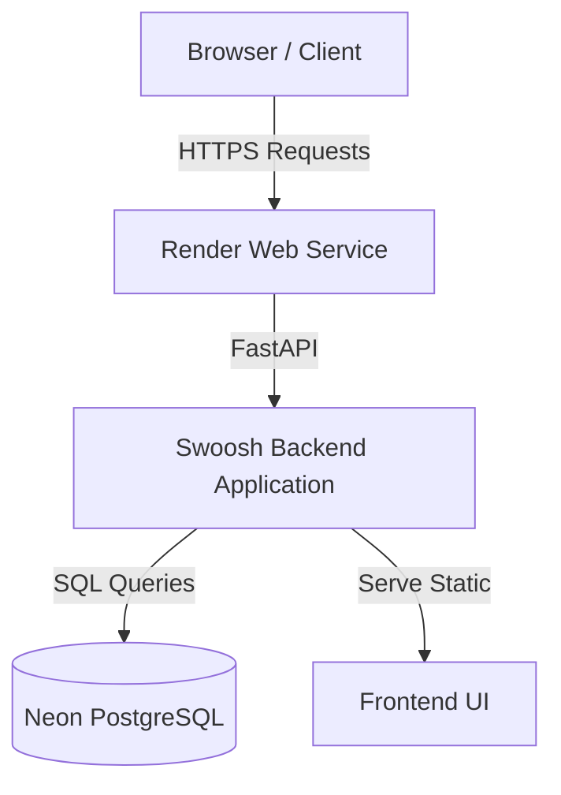
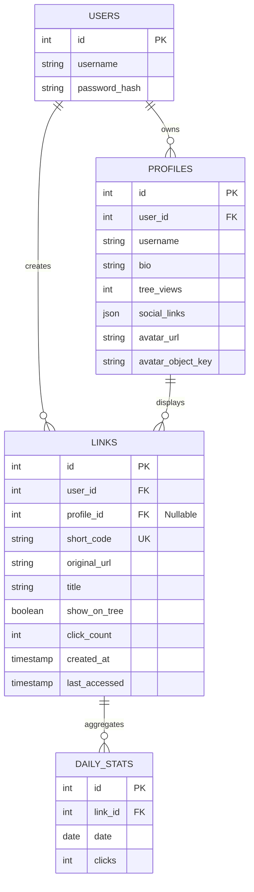

# Swoosh Architecture & System Design

## 1. System Overview

Swoosh is designed as a monolithic, self-contained application utilizing a **FastAPI backend** and a **Vanilla HTML/JS/CSS frontend**. It operates on a multi-tenant architecture, allowing multiple users to log in (registered by admin only, public registration is disabled), create public Link Tree profiles, and manage standalone short URLs.

## 2. Frontend Architecture (Vanilla SPA)

The frontend is built without heavy frameworks (React, Vue) to prioritize speed, simplicity, and low overhead. It acts as a Single Page Application (SPA) using vanilla JavaScript for DOM manipulation and routing.

### Core Files
- **`index.html`**: The main shell. It contains the raw HTML structure for all views (Login, Feature Selection, Profile Creation, Dashboard, Link Tree).
- **`style.css`**: Utilizes CSS variables for **Adaptive Theming** (Dark/Light mode via `@media (prefers-color-scheme)`). Implements a responsive layout featuring a **Desktop Sidebar** and a **Mobile Floating Dock**.
- **`script.js`**: The core controller.

### View Routing Mechanism
The frontend uses a simple CSS-class based routing mechanism.
1. The `hideAllViews()` function iterates through all main container divs and adds the `.hidden` class.
2. Specific functions like `showDashboard()` or `showFeatureSelection()` call `hideAllViews()`, then remove the `.hidden` class from their target div.
3. State is managed entirely via DOM data attributes and `localStorage`.

### State Management & Auth
- **`swoosh_token`**: Stored in `localStorage`. Contains the JWT string for API authentication.
- **`swoosh_active_profile`**: Stored in `localStorage`. Tracks whether the user is currently managing a specific Link Tree profile or operating in "Standalone Mode".

## 3. Backend Architecture (FastAPI)

The backend is built with Python 3.11 and FastAPI, chosen for its asynchronous capabilities, automatic OpenAPI documentation, and strict type validation (Pydantic).

### Core Components
- **`src/main.py`**: The application entry point. Initializes FastAPI, sets up middleware, static file serving, and includes routers.
- **`src/routers/`**: Contains modular endpoint logic (`auth.py`, `admin.py`, `profiles.py`, `links.py`, `redirects.py`).
- **`src/schemas.py`**: Pydantic models for strict type validation.
- **`src/dependencies.py`**: Shared logic such as `get_current_user`, `verify_admin`, and rate limiting (`slowapi`).
- **`src/config.py`**: Handles environment variables via `os.environ`.
- **`src/database.py`**: A database connection factory. Detects if `DATABASE_URL` is present (for Neon PostgreSQL) or falls back to a local SQLite file (`shortener.db`).
- **`src/analytics.py`**: Background task for flushing analytics to the database.

### Authentication Flow (JWT)
1. User POSTs credentials to `/api/login`.
2. Backend verifies credentials against the hashed password in the database (bcrypt).
3. Backend generates a JSON Web Token (JWT) signed with `JWT_SECRET` and returns it.
4. Client attaches the token as a header (`Authorization: Bearer <token>`) to all subsequent secure requests.
5. FastAPI's `get_current_user` dependency intercepts requests, decodes the JWT, and rejects invalid/expired tokens with a `401 Unauthorized` response.

## 4. Database Schema (Multi-Tenant)

The database structure is designed to support users having multiple Link Tree profiles, while also allowing standalone short links that aren't attached to any profile.

- **Standalone Mode**: When a user creates a link outside of a Link Tree, `profile_id` is set to `NULL`. The link is only associated with `user_id`.
- **Link Tree Mode**: Links created within a profile are assigned a `profile_id`, determining which links appear on the public `/api/users/{username}/tree` page.
- **Daily Stats**: Aggregate counts of clicks grouped by day. The foreign key `link_id` references `links(id)` with `ON DELETE CASCADE`.
- **Avatar Storage**: Avatars are stored in Cloudinary. The `profiles.avatar_url` is the secure delivery URL and the legacy-named `profiles.avatar_object_key` column stores the UUID-based Cloudinary `public_id` used for deletion.
- **Schema Migration Version**: Handled via the `schema_versions` table which keeps track of applied database migration scripts.

## 5. Security & Protection Mechanisms

Swoosh is designed to be self-hosted on public networks, meaning it is exposed to bots and malicious actors.
- **Rate Limiting**: `slowapi` enforces a strict 30 requests per minute per IP limit on write operations (like `/api/shorten`).
- **Input Validation**: Pydantic strictly validates all JSON bodies. Usernames and custom short codes are regex-checked to ensure they only contain alphanumeric characters and hyphens, preventing reserved-word collisions.
- **SQL Injection Prevention**: All queries to the SQLite/PostgreSQL database use parameterized SQL queries via the standard `sqlite3` and `psycopg2` libraries. No string formatting is used in SQL execution.
- **XSS Prevention**: When rendering the Link Tree frontend, user-provided values (like the profile bio or link titles) are sanitized before being inserted into the DOM using an `escapeHtml()` helper function.

## 6. Deployment Pipeline

The application is deployed to **Render** as a Web Service utilizing a **Docker runtime**.
1. Render pulls the latest code from the `main` branch.
2. Render builds the Docker image using the `Dockerfile` at the root of the repository.
3. Render runs the Docker container, launching `uvicorn src.main:app --host 0.0.0.0 --port $PORT` (binding to the port specified in `$PORT`).
4. Render injects securely configured Environment Variables at runtime, preventing secrets from leaking in git:
   - `DATABASE_URL`: Connection string for Neon PostgreSQL database.
   - `JWT_SECRET`: Secure 32-character (or longer) signing key for JWT tokens.
   - `ADMIN_PASSWORD_HASH`: Hashed bcrypt password for the initial admin account.
   - `CLOUDINARY_CLOUD_NAME`, `CLOUDINARY_API_KEY`, `CLOUDINARY_API_SECRET`: Configuration parameters for Cloudinary avatar image storage.
